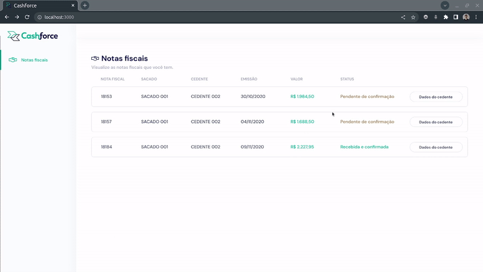
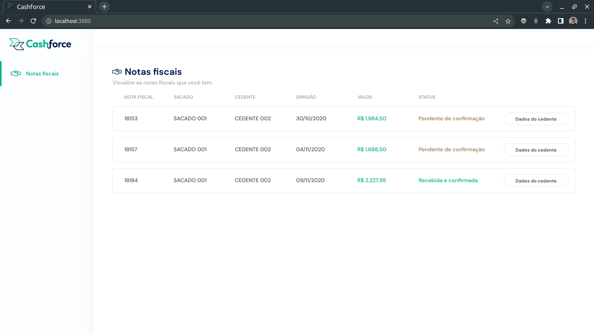

## Cashforce - Teste técnico

## Sobre
Aplicação desenvolvida durante o teste técnico da empresa Cashforce.
- Banco de dados MySQL;
- Back-end em NodeJS com Express e Sequelize (Arquitetura MSC - Model, Service e Controller);
- Front-end em React com CSS Modules;

## Front-end

  
GIF Demonstração Front-end

    

  
Imagem Front-end - Alta Resolução

    

## Como Rodar Localmente
A aplicação vai rodar nas portas 3000(front-end), 3001(back-end) e 3002(banco de dados). Portanto, antes da execução, elas devem estar disponíveis na sua máquina local.
- ``git clone git@github.com:erik-ymmt/cashforce-teste.git``
- ``cd cashforce-teste``
- ``docker-compose up``
- A aplicação não irá funcionar sem o banco rodando, portanto, aguarde o container db subir e:
- Execute o [SQL](https://gist.githubusercontent.com/Allan96/a3538e88600559587155a01b0330124e/raw/c7ad85e464dca320fbf54b5e84fb1dd79a888511/teste.sql) para criar o banco de dados da maneira que desejar (por ex.: MySQL Workbench). Importante: criar o Schema com o nome 'cashforce' (A criação do esquema não está no script, execute ``CREATE SCHEMA cashforce;
USE cashforce;``)
- Reinicie o container do back-end ``docker-compose restart backend``
- Pronto! Acesse o front-end em ``http://localhost:3000/``
